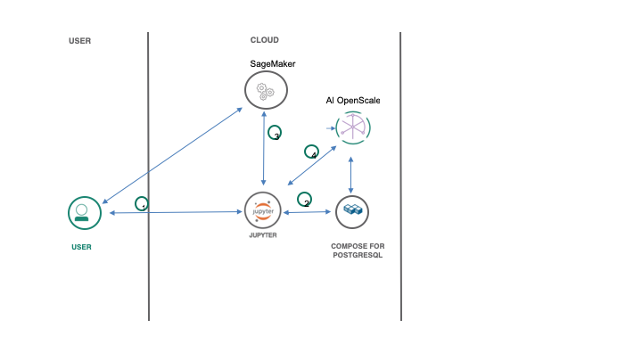
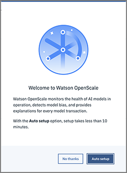
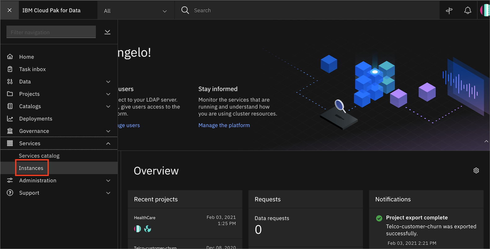
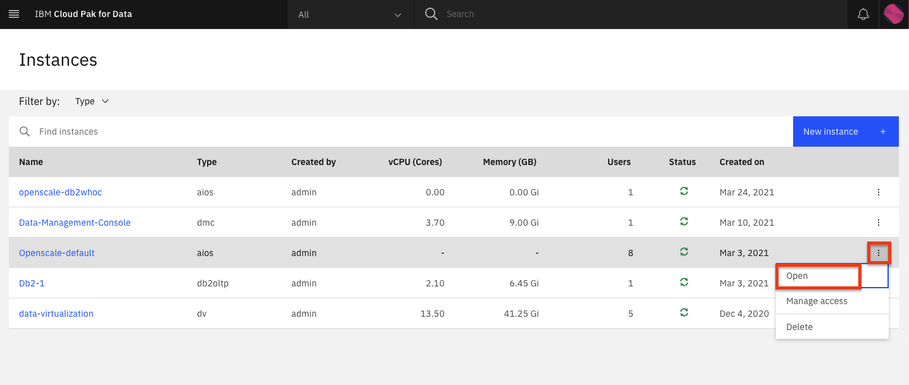
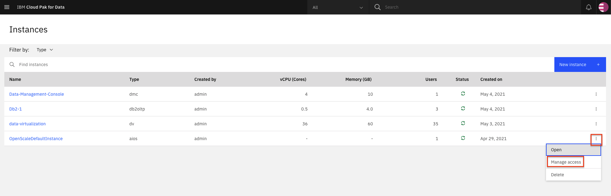
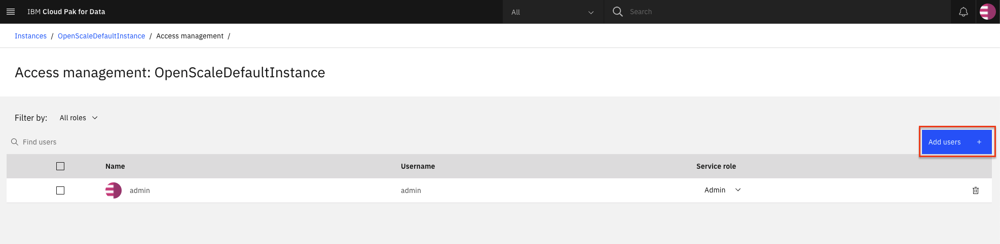
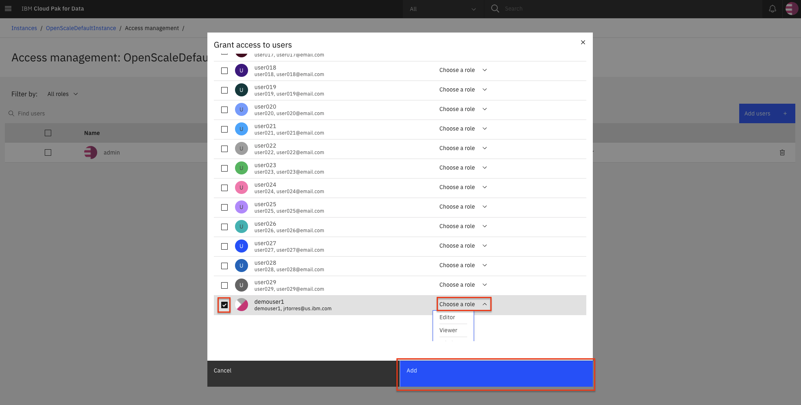
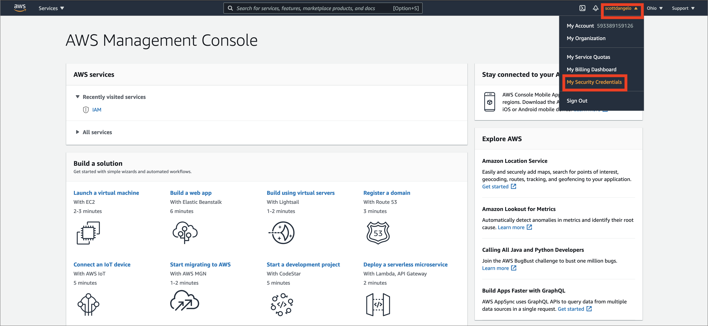
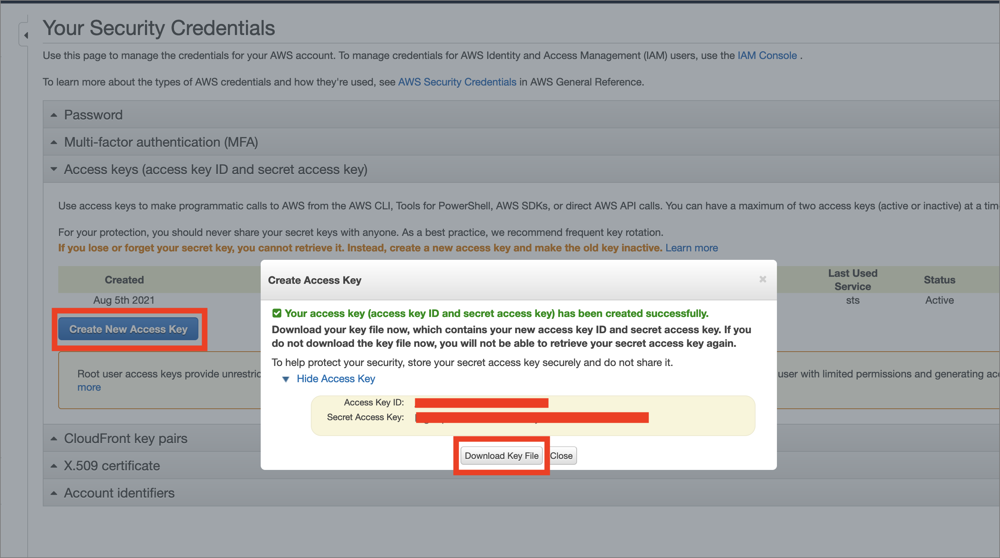
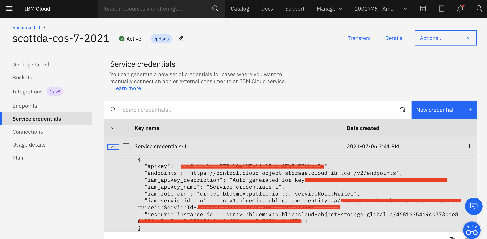

# Monitor Sagemaker ML With Watson OpenScale

In this Code Pattern, we will use a German Credit dataset to create a logistic regression model using AWS SageMaker. We will use Watson OpenScale to bind the ML model deployed in the AWS cloud, create a subscription, and perform payload and feedback logging.

When the reader has completed this Code Pattern, they will understand how to:

* Prepare data, train a model, and deploy using AWS SageMaker
* Score the model using sample scoring records and the scoring endpoint
* Bind the SageMaker model to the Watson OpenScale Data Mart
* Add subscriptions to the Data Mart
* Enable payload logging and performance monitoring for both subscribed assets
* Use Data Mart to access tables data via subscription



## Flow

1. The developer creates a Jupyter Notebook.
2. The Jupyter Notebook is connected to a PostgreSQL database, which is used to store Watson OpenScale data.
3. An ML model is created using Amazon SageMaker, using data from [credit_risk_training.csv](https://github.com/IBM/monitor-sagemaker-ml-with-watson-openscale/blob/master/data/credit_risk_training.csv),  and then it is deployed to the cloud.
4. Watson Open Scale is used by the notebook to log payload and monitor performance.

## Prerequisites

* An [IBM Cloud Account](https://cloud.ibm.com/)
* [IBM Cloud CLI](https://cloud.ibm.com/docs/cli/reference/ibmcloud/download_cli.html#install_use)
* [IBM Cloud Object Storage (COS)](https://www.ibm.com/cloud/object-storage)
* An account on [AWS SageMaker](https://aws.amazon.com/sagemaker/)

# Steps

1. [Clone the repository](#1-clone-the-repository)
1. [Create a Watson OpenScale service](#2-create-a-watson-openscale-service)
1. [Run the notebooks](#3-run-the-notebooks)

### 1. Clone the repository

```bash
git clone https://github.com/IBM/monitor-sagemaker-ml-with-watson-openscale
cd monitor-sagemaker-ml-with-watson-openscale
```

### 2. Create a Watson OpenScale service

Create Watson OpenScale, either on the IBM Cloud or using your On-Premise Cloud Pak for Data.

<details><summary>On IBM Cloud</summary>

* If you do not have an IBM Cloud account, [register for an account](https://cloud.ibm.com/registration)

* Create a Watson OpenScale instance from the [IBM Cloud catalog](https://cloud.ibm.com/catalog/services/watson-openscale)

* Select the *Lite* (Free) plan, enter a *Service name*, and click *Create*.

* Click *Launch Application* to start Watson OpenScale.

* Click *Auto setup* to automatically set up your Watson OpenScale instance with sample data.

  

* Click *Start tour*  to tour the Watson OpenScale dashboard.

</details>

<details><summary>On IBM Cloud Pak for Data platform</summary>

> Note: This assumes that your Cloud Pak for Data Cluster Admin has already installed and provisioned OpenScale on the cluster.

* In the Cloud Pak for Data instance, go the (☰) menu and under `Services` section, click on the `Instances` menu option.

  

* Find the `OpenScale-default` instance from the instances table and click the three vertical dots to open the action menu, then click on the `Open` option.

  

* If you need to give other users access to the OpenScale instance, go the (☰) menu and under `Services` section, click on the `Instances` menu option.

  

* Find the `OpenScale-default` instance from the instances table and click the three vertical dots to open the action menu, then click on the `Manage access` option.

  

* To add users to the service instance, click the `Add users` button.

  

* For all of the user accounts, select the `Editor` role for each user and then click the `Add` button.

  

</details>

### 4. Run the notebooks

There are 2 notebooks for this pattern. 

#### Run CreditModelSagemakerLinearLearner.ipynb

Begin by running [CreditModelSagemakerLinearLearner.ipynb](https://raw.githubusercontent.com/IBM/monitor-sagemaker-ml-with-watson-openscale/master/notebooks/CreditModelSagemakerLinearLearner.ipynb)

* You will need to [setup AWS SageMaker](https://docs.aws.amazon.com/sagemaker/latest/dg/gs-set-up.html)

#### Get AWS keys

* Get your AWS security credentials from the [AWS console](https://aws.amazon.com/console/) by highlighting your logged-in user and going to `My Security Credentials`:



* Click `Access keys (access key ID and secret access key)` -> `Create Access Key` and then download the key (and/or copy it from the screen) to obtain both the *AWSAccessKeyId* and the *AWSSecretKey*:



* Insert your AWS credentials after the cell *2.4.1 Add AWS credentials*. You can find your *region_name* from the URL of the AWS console when you are logged in, i.e. my URL is `https://us-east-2.console.aws.amazon.com/console/home?region=us-east-2` so my *region_name*  is `us-east-2`.

* Get your *bucket_name* by running `2.4.2 Get bucket name` and using the default bucket, or run the cell that follows using `[bkt.name for bkt in s3.buckets.all()]` to choose another bucket.

* Insert your AWS S3 `bucket_name` after the cell `2.4 Create an S3 bucket and use the name in the cell below for bucket_name`

* Move your cursor to each code cell and run the code in it. Read the comments for each cell to understand what the code is doing. **Important** when the code in a cell is still running, the label to the left changes to **In [\*]**:.
  Do **not** continue to the next cell until the code is finished running.

#### Run AIOpenscaleSagemakerMLengine.ipynb

Next Run [AIOpenscaleSagemakerMLengine.ipynb](https://raw.githubusercontent.com/IBM/monitor-sagemaker-ml-with-watson-openscale/master/notebooks/AIOpenscaleSagemakerMLengine.ipynb)

* Follow the instructions for `ACTION: Get Watson OpenScale instance_guid and apikey` using the [IBM Cloud CLI](https://console.bluemix.net/docs/cli/index.html#overview)

How to get api key using ibmcloud console:
```bash
ibmcloud login --sso
ibmcloud iam api-key-create 'my_key'
```
* Enter the *CLOUD_API_KEY* you just created after the cell *1.1.1 Add the IBM Cloud apikey as CLOUD_API_KEY*

#### Create COS bucket and get credentials


* In your [IBM Cloud Object Storage](https://www.ibm.com/cloud/object-storage)  instance, create a bucket with a globally unique name. The UI will let you know if there is a naming conflict. This will be used in cell *1.3.1* as *BUCKET_NAME*.

* In your [IBM Cloud Object Storage](https://www.ibm.com/cloud/object-storage) instance, get the Service Credentials for use as `COS_API_KEY_ID`, `COS_RESOURCE_CRN`, and `COS_ENDPOINT`:

  

* Add the COS credentials in cell *1.3*

* Insert your BUCKET_NAME in the cell *1.3.1 Add the BUCKET_NAME*.

* In the cell after `2.1 Bind SageMaker machine learning engine` enter your `SAGEMAKER_ENGINE_CREDENTIALS` using the keys you obtained in the step above for [Get AWS keys](#get-aws-keys).

* After running `3.1 Add subscriptions` you will get a `source_uid` to enter in the cell that follows.

* Move your cursor to each code cell and run the code in it. Read the comments for each cell to understand what the code is doing. **Important** when the code in a cell is still running, the label to the left changes to **In [\*]**:.
  Do **not** continue to the next cell until the code is finished running.

# Sample Output

See the [example output for CreditModelSagemakerLinearLearner-with-outputs.ipynb](notebooks/with-output/CreditModelSagemakerLinearLearner-with-outputs.ipynb)
See the [example output for AIOpenscaleSagemakerMLengine-with-output.ipynb](notebooks/with-output/AIOpenscaleSagemakerMLengine-with-output.ipynb)

# License

This code pattern is licensed under the Apache License, Version 2. Separate third-party code objects invoked within this code pattern are licensed by their respective providers pursuant to their own separate licenses. Contributions are subject to the [Developer Certificate of Origin, Version 1.1](https://developercertificate.org/) and the [Apache License, Version 2](https://www.apache.org/licenses/LICENSE-2.0.txt).

[Apache License FAQ](https://www.apache.org/foundation/license-faq.html#WhatDoesItMEAN)
